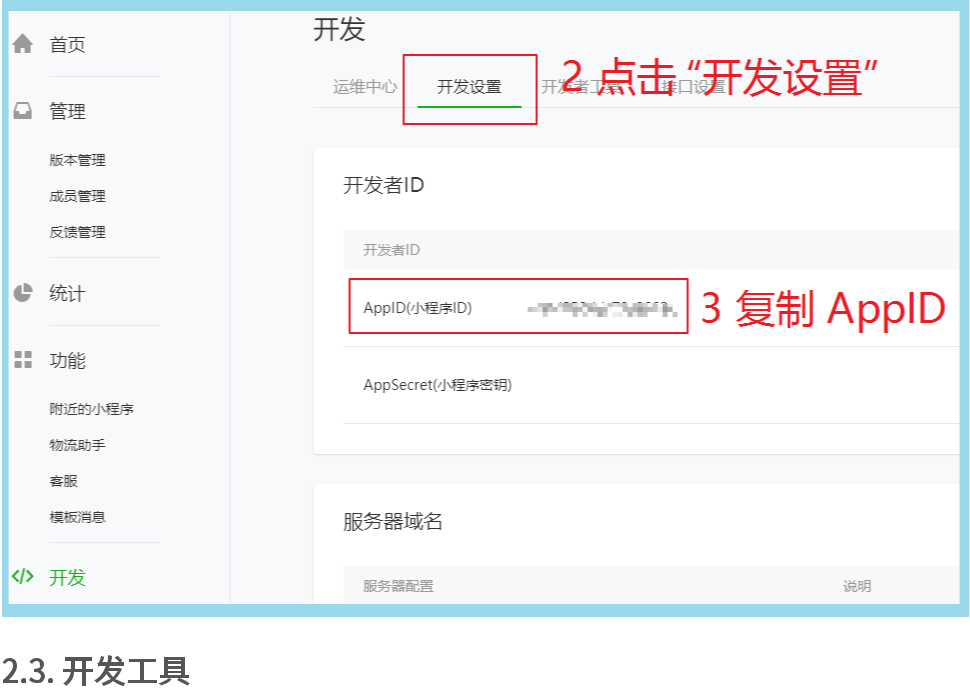
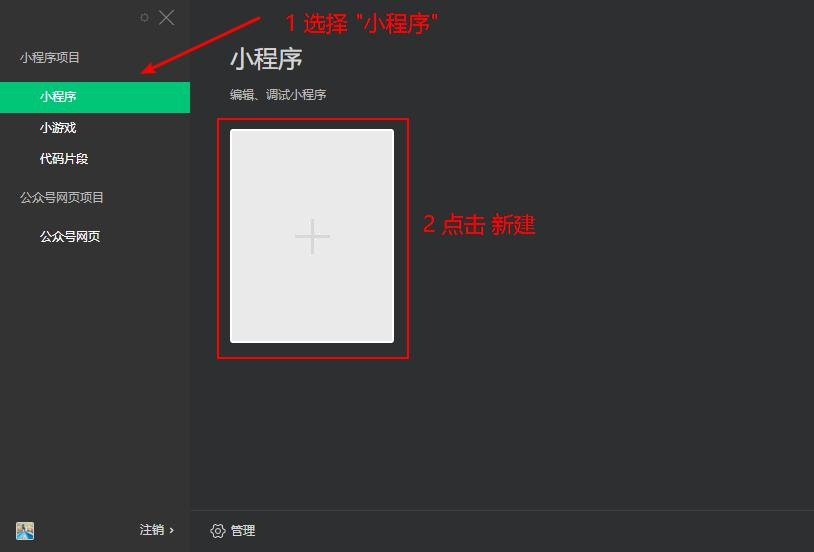
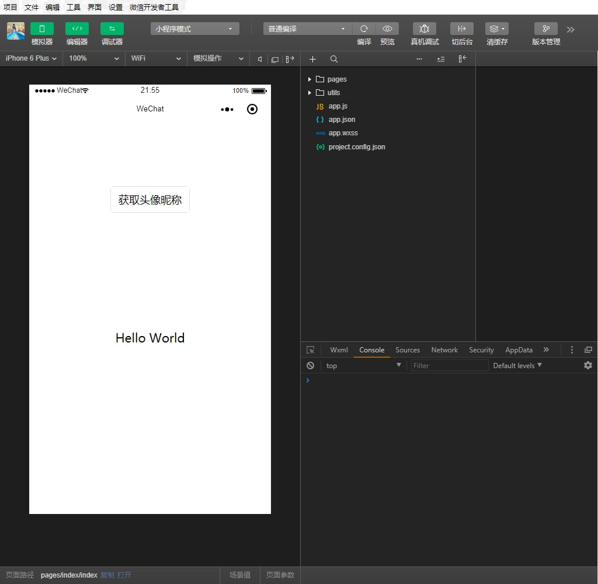
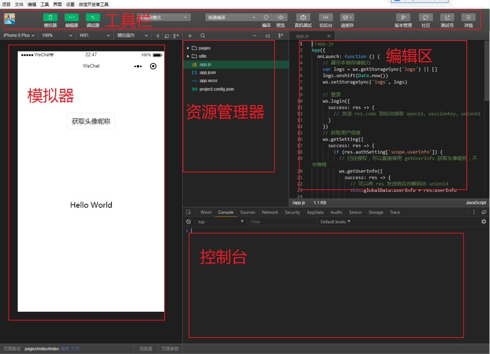
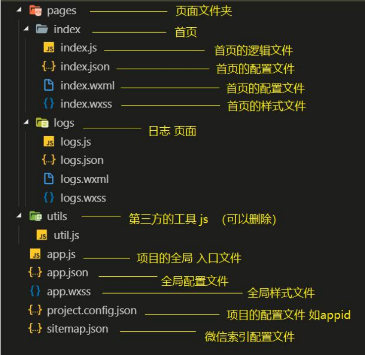

# 微信小程序 基础

[官网传送门](https://developers.weixin.qq.com/miniprogram/dev/framework/)

>推荐书籍：
> - 《微信小程序开发零基础入门》
> - 《微信小程序开发实战(微课视频版)》
>
>推荐视频：[零基础玩转微信小程序](https://www.bilibili.com/video/BV1nE41117BQ?spm_id_from=333.1007.top_right_bar_window_custom_collection.content.click)

## 1. 微信小程序介绍

 > - 微信小程序，简称小程序，英文名 `Mini Program` ，是一种不需要下载安装即可使用的应用
 >
 > - 它实现了应用“触⼿可及”的梦想，用户扫一扫或搜一下即可打开应用
 
### 1.1. 为什么是微信小程序 ？

1. 微信有海量用户，⽽且粘性很高，在微信⾥开发产品更容易触达用户；
2. 推广app 或公众号的成本太高。 
3. 开发适配成本低。 
4. 容易⼩规模试错，然后快速迭代。 
5. 跨平台。 

### 1.2. 微信小程序历史 

- 2016年1月11日，微信之父张小龙时隔多年的公开亮相，解读了微信的四⼤价值观。张小龙指出， 越来越多产品通过公众号来做，因为这⾥开发、获取用户和传播成本更低。拆分出来的服务号并没 有提供更好的服务，所以微信内部正在研究新的形态，叫「微信小程序」 需要注意的是，之前是叫 做 **应用号**。
- 2016年9月21日，微信小程序正式开启内测。在微信⽣态下，触⼿可及、用完即⾛的微信小程序引起广泛关注。腾讯云正式上线微信小程序解决方案，提供小程序在云端服务器的技术方案。
- 2017年1月9日，微信推出的“小程序”正式上线。“小程序”是一种⽆需安装，即可使用的⼿ 机“应用”。不需要像往常一样下载App，用户在微信中“用完即⾛”。

### 1.3. 疯狂的微信小程序 

1. 微信月活已经达到10.82亿。其中55岁以上的用户也达到6300万 
2. 信息传达数达到450亿，较去年增⻓18%;视频通话4.1亿次,增⻓100% 
3. 小程序覆盖超过200+行业，交易额增⻓超过6倍，服务1000亿+⼈次,创造出了5000亿+的商业价值

### 1.4. 还有其他的小程序 不容忽视

1. 支付宝小程序 
2. 百度小程序 
3. QQ小程序 
4. 今日头条 + 抖音小程序 

### 1.5. 体验 

#### 1.5.1. 官方微信小程序体验

[小程序示例源码](https://github.com/wechat-miniprogram/miniprogram-demo)


#### 1.5.2. 其他优秀的第三方小程序 

- 拼多多
- 滴滴出行 
- 欢乐斗地主 
- 智行火车票 
- 唯品会
- 。。。

## 2. 环境准备 

开发微信小程序之前，必须要准备好相应的环境 

### 2.1. 注册账号

> 建议使用全新的邮箱，没有注册过其他小程序或者公众号的。

访问[注册页面](https://mp.weixin.qq.com/wxopen/waregister?action=step1)，耐心完成注册即可。

### 2.2. 获取APPID

由于后期调用微信小程序的接⼝等功能，需要索取开发者的小程序中的 `APPID` ，所以在注册成功后， 可登录，然后获取`APPID`。 

登录，成功后可看到如下界面 

然后复制你的APPID,悄悄的保存起来，不要给别⼈看到😄。




### 2.3. 开发⼯具 

[下载地址](https://developers.weixin.qq.com/miniprogram/dev/devtools/download.html)


微信小程序⾃带开发者⼯具，集 **开发** **预览** **调试** 发布 于一身的 完整环境。 

但是由于编码的体验不算好，因此 建议使用 `vs code` + `微信开发者工具` 来实现编码。

`vs code` 负责敲代码， `微信开发者工具` 负责预览。

## 3. 第一个微信小程序 

### 3.1. 打开微信开发者⼯具 

> 注意：第一次登录的时候 需要扫码登录 


### 3.2. 新建小程序项目



### 3.3. 填写项目信息 


### 3.4. 成功



## 4. 微信开发者⼯具介绍

详细的使用，可以查看[官⽹](https://developers.weixin.qq.com/miniprogram/dev/devtools/devtools.html)



## 5. 小程序结构目录 

[小程序框架](https://developers.weixin.qq.com/miniprogram/dev/framework/MINA.html)的目标是通过尽可能简单、高效的方式让开发者可以在微信中开发具有原⽣APP体验的服务。

小程序框架提供了自己的视图层描述语言 `WXML` 和 `WXSS` ，以及 `JavaScript` ，并在视图层与逻辑层间提供了数据传输和事件系统，让开发者能够专注于数据与逻辑。 

### 5.1. 小程序文件结构和传统web对比

| 结构 | 传统web | 微信小程序 |
|:---:|:---:|:----:|
| 结构 | HTML | WXML |
| 样式 | CSS | WXSS | 
| 逻辑 | Javascript | Javascript | 
| 配置 | ⽆ | JSON |

通过以上对比得出，**传统web**是三层结构。⽽微信小程序 是四层结构，多了一层 **配置.json**

### 5.2. 基本的项目目录



## 6. 小程序配置文件

一个小程序应用程序会包括最基本的**两种**配置文件。

> - 一种是全局的 `app.json` 和 页面自己的 `page.json`
> - 注意：配置文件中不能出现注释

### 6.1. [全局配置 app.json](https://developers.weixin.qq.com/miniprogram/dev/framework/config.html)

`app.json` 是当前小程序的全局配置，包括了小程序的所有页面路径、界面表现、⽹络超时时间、底部tab等。**普通快速启动项目**⾥边的 `app.json` 配置.

```json
{
  "pages":[
    "pages/index/index",
    "pages/logs/logs"
 ],
  "window":{
    "backgroundTextStyle":"light",
    "navigationBarBackgroundColor": "#fff",
    "navigationBarTitleText": "WeChat",
    "navigationBarTextStyle":"black"
 }
}
```

字段的含义 
1. `pages` 字段⸺用于描述当前小程序所有页面路径，这是为了让微信客⼾端知道当前你的小程序 页面定义在哪个目录。 
2. `window` 字段⸺定义小程序所有页面的顶部背景颜色，文字颜色定义等。 
3. 完整的配置信息请参考 [app.json配置](https://developers.weixin.qq.com/miniprogram/dev/reference/configuration/app.html)

#### 6.1.1. tabbar 


### 6.2. [页面配置page.json](https://developers.weixin.qq.com/miniprogram/dev/reference/configuration/page.html)

这⾥的 `page.json` 其实用来表示页面目录下的 `page.json` 这类和小程序页面相关的配置。 

开发者可以独立定义每个页面的一些属性，如顶部颜色、是否允许下拉刷新等等。 

页面的配置只能设置 `app.json` 中部分 `window` 配置项的内容，页面中配置项会覆盖 `app.json` 的 `window` 中相同的配置项。

| 属性 | 类型 | 默认值 | 描述 | 
|---|:---:|:---:|---|
|navigationBarBackgroundColor|HexColor|#000000|导航栏背景颜色，如#000000|
|navigationBarTextStyle|String|white|导航栏标题颜色，仅⽀持 `black` / `white`|
|navigationBarTitleText|String||导航栏标题文字内容| 
|backgroundColor|HexColor|#ffffff|窗⼝的背景色|
|backgroundTextStyle|String|dark|下拉loading的样式，仅⽀持 `dark` / `light`|
|enablePullDownRefresh|Boolean|false|是否全局开启下拉刷新。 详⻅ [Page.onPullDownRefresh](https://developers.weixin.qq.com/miniprogram/dev/framework/app-service/page.html#onpulldownrefresh)| 
|onReachBottomDistance|Number|50|页面上拉触底事件触发时距页面底部距离，单位为px。详⻅ [Page.onReachBottom](https://developers.weixin.qq.com/miniprogram/dev/framework/app-service/page.html#onreachbottom)|
|disableScroll|Boolean|false|设置为 `true` 则页面整体不能上下滚动；只在页面配置中有效，⽆法在`app.json`中设置该项|

### 6.3. [sitemap 配置-了解即可](https://developers.weixin.qq.com/miniprogram/dev/reference/configuration/sitemap.html)

小程序根目录下的 `sitemap.json` 文件用于配置小程序及其页面是否允许被微信索引。 

## 7. 模板语法

WXML（WeiXin Markup Language）是框架设计的一套标签语言，结合[基础组件](https://developers.weixin.qq.com/miniprogram/dev/component/)、[事件系统](https://developers.weixin.qq.com/miniprogram/dev/framework/view/wxml/event.html)，可以构建出页面的结构。

### 7.1. 数据绑定 

#### 7.1.1. 普通写法

```html
<view> {{ message }} </view>
```

```js
Page({
  data: {
    message: 'Hello MINA!'
 }
})
```

#### 7.1.2. 组件属性

```html
<view id="item-{{id}}"> </view>
```

```js
Page({
  data: {
    id: 0
 }
})
```

#### 7.1.3. bool类型

不要直接写 `checked="false"`，其计算结果是一个字符串。

```html
<checkbox checked="{{false}}"> </checkbox>
```

### 7.2. 运算

#### 7.2.1. 三元运算

```html
<view hidden="{{flag ? true : false}}"> Hidden </view>
```

#### 7.2.2. 算数运算

```html
<view> {{a + b}} + {{c}} + d </view>
```

```js
Page({
  data: {
    a: 1,
    b: 2,
    c: 3
 }
})
```

#### 7.2.3. 逻辑判断

```html
<view wx:if="{{length > 5}}"> </view>
```

#### 7.2.4. 字符串运算

```html
<view>{{"hello" + name}}</view>
```

```js
Page({
  data:{
    name: 'MINA'
 }
})
```

#### 7.2.5. 注意

> - 花括号和引号之间如果有空格，将最终被解析成为字符串。

### 7.3. 列表渲染

#### 7.3.1. wx:for

项的变量名默认为 `item` `wx:for--item` 可以指定数组当前元素的变量名。

下标变量名默认为 `index` `wx:for--index` 可以指定数组当前下标的变量名。

`wx:key` 用来提高数组渲染的性能

`wx:key` 绑定的值 有如下选择
1. `string` 类型，表示循环项中的唯一属性 如 

```js
list:[{id:0,name:"炒饭"},{id:1,name:"炒面"}]
wx:key="id"
```

2. 保留字 `*this` ，它的意思是 `item`本身 ，`*this` 代表的必须是：唯一的字符串和数组。

```js
list:[1,2,3,4,5]
wx:key="*this"
```

代码：

```html
<view wx:for="{{array}}" wx:key="id">
 {{index}}: {{item.message}}
</view>
```

```js
Page({
  data: {
    array: [{
      id:0,
      message: 'foo',
   }, {
      id:1,
      message: 'bar'
   }]
 }
})
```

#### 7.3.2. block

渲染一个包含多节点的结构块 block 最终不会变成真正的dom元素

```html
<block wx:for="{{[1, 2, 3]}}" wx:key="*this" >
  <view> {{index}}: </view>
  <view> {{item}} </view>
</block>
```

### 7.4. 条件渲染

#### 7.4.1. wx:if

在框架中，使用 `wx:if="{{condition}}"` 来判断是否需要渲染该代码块：

```html
<view wx:if="{{false}}">1</view>
<view wx:elif="{{true}}">2</view>
<view wx:else>3</view>
```

#### 7.4.2. hidden

```html
<view hidden="{{condition}}"> True </view>
```

- 类似 `wx:if`
- 频繁切换 用 `hidden`
- 不常使用 用 `wx:if`

## 8. 小程序事件的绑定

- 小程序中绑定事件，通过`bind`关键字来实现。如 `bindtap` `bindinput` `bindchange` 等
- 不同的组件⽀持不同的事件，具体看组件的说明即可。

### 8.1. wxml

```html
<input bindinput="handleInput" />
```

### 8.2. page

```js
Page({
  // 绑定的事件
  handleInput: function(e) {
    console.log(e);
    console.log("值被改变了");
 }
})
```

### 8.3. 特别注意

1. 绑定事件时不能带参数 不能带括号**以下为错误写法**

```html
<input bindinput="handleInput(100)" />
```

2. 事件传值 通过标签⾃定义属性的方式 和 `value`

```html
<input bindinput="handleInput" data-item="100" />
```

3. 事件触发时获取数据

```js
handleInput: function(e) {
    // {item:100}
   console.log(e.currentTarget.dataset)
      
    // 输入框的值
   console.log(e.detail.value);
 }
 ```

## 9. [样式 WXSS](https://developers.weixin.qq.com/miniprogram/dev/framework/view/wxss.html)

- WXSS( `WeiXin Style Sheets` )是一套样式语言，用于描述 `WXML` 的组件样式。
- 与 **CSS** 相比，**WXSS** 扩展的特性有： 
  - 响应式⻓度单位 `rpx`
  - 样式导⼊ 

### 9.1. 尺⼨单位

- `rpx` （responsive pixel）: 可以根据屏幕宽度进行⾃适应。规定屏幕宽为 `750rpx` 。
- 如在`iPhone6`上，屏幕宽度为`375px`，共有750个物理像素，
- 则`750rpx = 375px =  750物理像素` ，`1rpx = 0.5px = 1物理像素`。

| 设备 | rpx换算px (屏幕宽度/750) | px换算rpx (750/屏幕宽度) |
| --- | --- |--- |
| iPhone5| 1rpx = 0.42px | 1px = 2.34rpx |
| iPhone6 | 1rpx = 0.5px | 1px = 2rpx |
| iPhone6 Plus | 1rpx = 0.552px | 1px = 1.81rpx |

>**建议**： 开发微信小程序时设计师可以用 iPhone6 作为视觉稿的标准。

使用步骤： 
1. 确定设计稿宽度 pageWidth 
2. 计算比例 `750rpx = pageWidth px` ,因此 `1px=750rpx/pageWidth` 。 
3. 在less文件中，只要把设计稿中的 `px` => `750/pageWidth rpx` 即可。

### 9.2. 样式导⼊

- wxss中直接就⽀持，样式导⼊功能。
- 也可以和 less中的导⼊混用。 
- 使用 `@import` 语句可以导⼊外联样式表，只⽀持**相对路径**。 

示例代码：

```css
/** common.wxss **/
.small-p {
  padding:5px; 
 }
```

```css
/** app.wxss **/
@import "common.wxss";
.middle-p {
  padding:15px; 
 }
```

### 9.3. 选择器

> - 特别需要注意的是 小程序 不⽀持通配符 * 因此以下代码⽆效！！！

```css
*{
    margin:0;
    padding:0;
    box-sizing:border-box; 
 }
```

目前⽀持的选择器有：

| 选择器 | 样例 | 样例描述 |
| --- | --- | --- |
| .class | `.intro` | 选择所有拥有 class="intro" 的组件 |
| #id | `#firstname` | 选择拥有 id="firstname" 的组件 |
 |element | `view` | 选择所有 view 组件 |
| element, element | `view,checkbox` | 选择所有文档的 view 组件和所有的 checkbox 组件 |
| nth-child(n) | `view:nth-child(n)` | 选择某个索引的标签 |
| ::after | `view::after` | 在 view 组件后边插⼊内容 |
| ::before | `view::before` | 在 view 组件前边插⼊内容 |

### 9.4. 小程序中使用less

原⽣小程序不⽀持`less`，其他基于小程序的框架⼤体都⽀持，如 wepy ， mpvue ， taro 等。

但是仅仅因为一个less功能，⽽去引⼊一个框架，肯定是不可取的。因此可以用以下方式来实现

1. 编辑器是`vscode`
2. 安装插件`easy less`


3. 在vs code的设置中加⼊如下配置

```json
 "less.compile": {
        "outExt":       ".wxss"
   }
```

4. 在要编写样式的地方，新建 `less` 文件，如 `index.less` ,然后正常编辑即可。

## 10. [常⻅组件](https://developers.weixin.qq.com/miniprogram/dev/component/) 

重点讲解小程序中常用的布局组件

- `view`,`text`,`rich--text`,`button`,`image`,
- `navigator`,`icon`,`swiper`,`radio`,`checkbox`等 

### 10.1. [view](https://developers.weixin.qq.com/miniprogram/dev/component/view.html)

代替原来的`div`标签

```html
<view hover-class="h-class">
点击我试试
</view>
```

### 10.2. [text](https://developers.weixin.qq.com/miniprogram/dev/component/text.html)

1. 文本标签 
2. 只能嵌套text 
3. ⻓按文字可以复制（只有该标签有这个功能） 
4. 可以对空格 回⻋ 进行编码 

| 属性名 | 类型 | 默认值 | 说明 |
| --- | --- | --- | --- |
| selectable | Boolean | false | 文本是否可选 |
| decode | Boolean | false | 是否解码 |

#### 10.2.1. 代码

```html
  <text selectable="{{false}}" decode="{{false}}">
   普&nbsp;通
  </text>
 ```

### 10.3. [image](https://developers.weixin.qq.com/miniprogram/dev/component/image.html)

 1. 图⽚标签，image组件默认宽度320px、高度240px 
 2. ⽀持懒加载

| 属性名 | 类型 | 默认值 | 说明 | 
| --- | --- | --- | --- |
| src | String |  | 图⽚资源地址 |
| mode | String | scaleToFill | 图⽚裁剪、缩放的模式 |
| lazy-load | Boolean | false | 图⽚懒加载 |

**mode 有效值：**

mode 有 13 种模式，其中 4 种是缩放模式，9种是裁剪模式。

| 模式 | 值 | 说明 |
| --- | --- | --- |
|缩放| scaleToFill| 不保持纵横比缩放图⽚，使图⽚的宽高完全拉伸⾄填满image元素 |
|缩放| aspectFit |保持纵横比缩放图⽚，使图⽚的⻓边能完全显示出来。| 
|缩放| aspectFill| 保持纵横比缩放图⽚，只保证图⽚的短边能完全显示出来。 |
|缩放| widthFix| 宽度不变，高度⾃动变化，保持原图宽高比不变 |
|裁剪| top |不缩放图⽚，只显示图⽚的顶部区域 |
|裁剪| bottom |不缩放图⽚，只显示图⽚的底部区域 |
|裁剪| center| 不缩放图⽚，只显示图⽚的中间区域 |
|裁剪| left| 不缩放图⽚，只显示图⽚的左边区域 |
|裁剪| right |不缩放图⽚，只显示图⽚的右边区域 |
|裁剪| top left |不缩放图⽚，只显示图⽚的左上边区域 |
|裁剪| top right |不缩放图⽚，只显示图⽚的右上边区域 |
|裁剪| bottom left |不缩放图⽚，只显示图⽚的左下边区域 |
|裁剪| bottom right| 不缩放图⽚，只显示图⽚的右下边区域 |
 
### 10.4. [swiper](https://developers.weixin.qq.com/miniprogram/dev/component/swiper.html)

>- 微信内置轮播图组件


**默认宽度 100% 高度 150px**

|属性名| 类型| 默认值| 说明|
|---|---|---|---|
|indicator-dots| Boolean |false| 是否显示面板指示点| 
|indicator-color| Color| rgba(0, 0, 0, .3)| 指示点颜色 |
|indicator-active-color| Color| #000000 |当前选中的指示点颜色 |
|autoplay| Boolean| false |是否⾃动切换 |
|interval| Number| 5000 |⾃动切换时间间隔 |
|circular| Boolean |false| 是否循环轮播 | 

#### 10.4.1. swiper 

>滑块视图容器

#### 10.4.2. swiper-item

>滑块

默认宽度和高度都是100%

### 10.5. navigator

>导航组件 类似超链接标签

| 属性名 | 类型 | 默认值 | 说明 |
| --- | --- | --- | --- |
| target |String| self| 在哪个目标上发⽣跳转，默认当前小程序，可选值 self/miniProgram |
| url | String | | 当前小程序内的跳转链接 |
| open-type | String | navigate | 跳转方式 |

**open-type 有效值：**

| 值 | 说明 |
| --- | --- |
| navigate | 保留当前页面，跳转到应用内的某个页面，但是不能跳到tabbar页面。|
| redirect | 关闭当前页面，跳转到应用内的某个页面，但是不允许跳转到tabbar页面。|
| switchTab | 跳转到tabBar页面，并关闭其他所有⾮tabBar页面。|
| reLaunch | 关闭所有页面，打开到应用内的某个页面。|
| navigateBack | 关闭当前页面，返回上一页面或多级页面。可通过 [getCurrentPages()](https://developers.weixin.qq.com/miniprogram/dev/framework/app-service/route.html#getcurrentpages) 获取当 前的页面栈，决定需要返回⼏层。 |
| exit | 退出小程序，target="miniProgram"时⽣效。 |

### 10.6. rich-text

>富文本标签

可以将字符串解析成 对应标签，类似 vue中 `v--html` 功能


代码

```html
// 1   index.wxml 加载 节点数组 
<rich-text nodes="{{nodes}}" bindtap="tap"></rich-text>
// 2 加载 字符串 
<rich-text nodes=''>
</rich-text>
```
 
```js
// index.js
    
Page({
  data: {
    nodes: [{
      name: 'div',
      attrs: {
        class: 'div_class',
        style: 'line-height: 60px; color: red;'
     },
      children: [{
        type: 'text',
        text: 'Hello&nbsp;World!'
     }]
   }]
 },
  tap() {
    console.log('tap')
 }
})
```
 
#### 10.6.1. nodes属性

`nodes`属性⽀持`字符串`和 `标签节点数组`

| 属性 | 说明 | 类型 | 必填 | 备注 |
| --- | --- | --- | --- | --- |
| name | 标签名 | string | 是 | ⽀持部分受信任的HTML节点 |
| attrs | 属性| object | 否 | ⽀持部分受信任的属性，遵循Pascal命名法 |
| children | ⼦节点列表 | array | 否 | 结构和 nodes 一致|

**文本节点：type = text**

| 属性 | 说明 | 类型 | 必填 | 备注 |
| --- | --- | --- | --- | --- |
| text | 文本 | string | 是 | ⽀持entities |

- nodes 不推荐使用 String 类型，性能会有所下降。
- rich--text 组件内屏蔽所有节点的事件。
- attrs 属性不⽀持 id ，⽀持 class 。
- name 属性⼤⼩写不敏感。 如果使用了不受信任的 HTML 节点，该节点及其所有⼦节点将会被移除。
- img 标签仅⽀持⽹络图⽚。 

### 10.7. button 


```html
<button
  type="default"
  size="{{defaultSize}}"
  loading="{{loading}}"
  plain="{{plain}}"
>
 default
</button>
```

|属性 |类型 |默认值| 必填| 说明 |
|---|---|---|---|---|
|size| string |default| 否| 按钮的⼤⼩ |
|type |string| default| 否| 按钮的样式类型 |
|plain |boolean |false| 否| 按钮是否镂空，背景色透明 |
|disabled |boolean |false| 否| 是否禁用 |
|loading |boolean |false| 否| 名称前是否带 loading 图标 |
|form- type |string| |否| 用于 \`\` 组件，点击分别会触发 \`\` 组件的 submit/reset 事件|
|open- type |string| |否| 微信开放能⼒|

**size 的合法值**

| 值 | 说明 |
| --- | --- |
| default | 默认⼤⼩ |
| mini | ⼩尺⼨ |

**type 的合法值**

| 值 | 说明 |
| --- | --- |
| primary | 绿色 |
| default | ⽩色 |
| warn | 红色 |

**form-type 的合法值**

| 值 | 说明 |
| --- | --- |
| submit | 提交表单 | 
| reset | 重置表单 |

**open-type 的合法值**
 
| 值 | 说明 |
| --- | --- |
| contact | 打开客服会话，如果用户在会话中点击消息卡⽚后返回小程序，可以从bindcontact 回调中获得具体信息，[具体说明](https://developers.weixin.qq.com/miniprogram/dev/framework/open-ability/customer-message/customer-message.html) |
| share | 触发用户转发，使用前建议先阅读[使用指引](https://developers.weixin.qq.com/miniprogram/dev/framework/open-ability/share.html#%E4%BD%BF%E7%94%A8%E6%8C%87%E5%BC%95) |
| getPhoneNumber | 获取用户⼿机号，可以从bindgetphonenumber回调中获取到用户信息， [具体说明](https://developers.weixin.qq.com/miniprogram/dev/framework/open-ability/getPhoneNumber.html) |
| getUserInfo | 获取用户信息，可以从bindgetuserinfo回调中获取到用户信息 |
| launchApp | 打开APP，可以通过app-parameter属性设定向APP传的参数[具体说明](https://developers.weixin.qq.com/miniprogram/dev/framework/open-ability/launchApp.html) |
| openSetting | 打开授权设置⻚ |
| feedback | 打开“意⻅反馈”页面，用户可提交反馈内容并上传[日志](https://developers.weixin.qq.com/miniprogram/dev/api/base/debug/wx.getLogManager.html)，开发者可以登录[小程序管理后台](https://mp.weixin.qq.com/)后进⼊左侧菜单“客服反馈”页面获取到反馈内容|

**open-type的contact的实现流程**

1. 将小程序的 `appid` 由测试号改为自己的 `appid`
2. 登录微信小程序官⽹，添加 客服客服 -- 微信微信
3. 为了方便演示，⽼师自己准备了两个账号 
    1. 普通用户 A 
    2. 客服-微信 B
4. 就是⼲！

### 10.8. [icon](https://developers.weixin.qq.com/miniprogram/dev/component/icon.html)

| 属性 | 类型 | 默认值 | 必填 | 说明 |
| --- | --- | --- | --- | --- |
|type| string| |是 |icon的类型，有效值：success, success_no_circle, info, warn, waiting, cancel, download, search, clear| |size| number/string| 23 |否| icon的⼤⼩ |
|color| string| |否 |icon的颜色，同css的color|


**代码:**

```js
Page({
  data: {
    iconSize: [20, 30, 40, 50, 60, 70],
    iconType: [
      'success', 'success_no_circle', 'info', 'warn', 'waiting', 'cancel',
'download', 'search', 'clear'
   ],
    iconColor: [
      'red', 'orange', 'yellow', 'green', 'rgb(0,255,255)', 'blue', 'purple'
   ],
 }
})
```

```html
<view class="group">
  <block wx:for="{{iconSize}}">
    <icon type="success" size="{{item}}"/>
  </block>
</view> <view class="group">
  <block wx:for="{{iconType}}">
    <icon type="{{item}}" size="40"/>
  </block>
</view> <view class="group">
  <block wx:for="{{iconColor}}">
    <icon type="success" size="40" color="{{item}}"/>
  </block>
</view>
```

### 10.9. [radio](https://developers.weixin.qq.com/miniprogram/dev/component/radio.html)

>可以通过 color属性来修改颜色


需要搭配 [radio-group](https://developers.weixin.qq.com/miniprogram/dev/component/radio-group.html) 一起使用

### 10.10. [checkbox](https://developers.weixin.qq.com/miniprogram/dev/component/checkbox.html)

>可以通过 color属性来修改颜色


需要搭配 [checkbox-group](https://developers.weixin.qq.com/miniprogram/dev/component/checkbox-group.html) 一起使用

## 11. ⾃定义组件

>类似vue或者react中的自定义组件。

小程序允许我们使用⾃定义组件的方式来构建页面。

### 11.1. 创建⾃定义组件

>类似于页面，一个自定义组件由 `json` `wxml` `wxss` `js` 4个文件组成

可以在微信开发者⼯具中快速创建组件的文件结构


在文件夹内 `components/myHeader` ，创建组件名为 `myHeader`


#### 11.1.1. 声明组件 

⾸先需要在组件的 `json` 文件中进行⾃定义组件声明

`myHeader.json`

```json
{
  "component": true
}
```

#### 11.1.2. 编辑组件

同时，还要在组件的 `wxml` 文件中编写组件模板，在 `wxss` 文件中加⼊组件样式
`slot` 表示插槽，类似vue中的slot

`myHeader.wxml`

```html
<!-- 这是自定义组件的内部WXML结构 -->
<view class="inner">
 {{innerText}}
    <slot></slot>
</view>
```

在组件的 `wxss` 文件中编写样式

>注意：在组件`wxss`中不应使用ID选择器、属性选择器和标签名选择器。

`myHeader.wxss`

```css
/* 这里的样式只应用于这个自定义组件 */
.inner {
  color: red; }
```

#### 11.1.3. 注册组件 

在组件的 `js` 文件中，需要使用 `Component()` 来注册组件，并提供组件的属性定义、内部数据和 ⾃定义方法

`myHeader.js`

```js
Component({
  properties: {
    // 这里定义了innerText属性，属性值可以在组件使用时指定
    innerText: {
      // 期望要的数据是 string类型
      type: String,
      value: 'default value',
    }
 },
  data: {
    // 这里是一些组件内部数据
    someData: {}
 },
  methods: {
    // 这里是一个自定义方法
    customMethod: function(){}
 }
})
```

### 11.2. 声明引⼊⾃定义组件 

⾸先要在页面的 `json` 文件中进行引用声明。还要提供对应的组件名和组件路径

`index.wxml`

```html
{
 // 引用声明
  "usingComponents": {
 // 要使用的组件的名称     // 组件的路径
    "my-header":"/components/myHeader/myHeader"
 }
}
```

### 11.3. 页面中使用⾃定义组件

```html
<view>
  <!-- 以下是对一个自定义组件的引用 -->
  <my-header inner-text="Some text">
    <view>用来替代slot的</view>
    </my-header>
</view>
```

### 11.4. 其他属性 

### 11.5. 定义段与示例方法

`Component` 构造器可用于定义组件，调用 `Component` 构造器时可以指定组件的属性、数据、方法等。

|定义段| 类型 |是否必填| 描述 |
|---|---|---|---|
|properties| Object Map| 否 |组件的对外属性，是属性名到属性设置的映射表，参⻅下文 |
|data |Object| 否| 组件的内部数据，和 properties 一同用于组件的模板渲染 |
|observers| Object| 否| 组件数据字段监听器，用于监听 properties 和 data 的变化，参⻅[数据监听器](https://developers.weixin.qq.com/miniprogram/dev/framework/custom-component/observer.html) |
|methods| Object| 否 |组件的方法，包括事件响应函数和任意的⾃定义方法，关于事件响应函数的使用，参⻅[组件事件](https://developers.weixin.qq.com/miniprogram/dev/framework/custom-component/events.html) |
|created |Function| 否| 组件⽣命周期函数，在组件实例刚刚被创建时执行，注意此时不能调用 setData ，参⻅[组件⽣命周期](https://developers.weixin.qq.com/miniprogram/dev/framework/custom-component/lifetimes.html) |
|attached| Function| 否| 组件⽣命周期函数，在组件实例进⼊页面节点树时执行，参⻅[组件⽣命周期](https://developers.weixin.qq.com/miniprogram/dev/framework/custom-component/lifetimes.html) |
|ready |Function| 否 |组件⽣命周期函数，在组件布局完成后执行，参⻅[组件⽣命周期](https://developers.weixin.qq.com/miniprogram/dev/framework/custom-component/lifetimes.html) |
|moved| Function |否 |组件⽣命周期函数，在组件实例被移动到节点树另一个位置时执行，参⻅[组件⽣命周期](https://developers.weixin.qq.com/miniprogram/dev/framework/custom-component/lifetimes.html) |
|detached |Function| 否 |组件⽣命周期函数，在组件实例被从页面节点树移除时执行，参⻅[组件⽣命周期](https://developers.weixin.qq.com/miniprogram/dev/framework/custom-component/lifetimes.html)|

### 11.6. 组件-⾃定义组件传参

1. 父组件通过**属性**的方式给⼦组件传递参数 
2. ⼦组件通过**事件**的方式向父组件传递参数 

#### 11.6.1. 过程 

1. **父组件** 把数据 `{{tabs}}` 传递到 ⼦组件的 `tabItems` 属性中 
2. **父组件** 监听 `onMyTab` 事件 
3. **⼦组件** 触发 `bindmytap` 中的 `mytap` 事件
    - ⾃定义组件触发事件时，需要使用 triggerEvent 方法，指定 事件名 、 detail 对象
4. 父 -> ⼦ 动态传值 this.selectComponent("#tabs");

**父组件代码**

```html
// page.wxml
<tabs tabItems="{{tabs}}" bindmytap="onMyTab" >
 内容-这里可以放插槽
</tabs>
// page.js
  data: {
    tabs:[
     {name:"体验问题"},
     {name:"商品、商家投诉"}
   ]
 },
  onMyTab(e){
    console.log(e.detail);
 },
```

**⼦组件代码**

```html
// com.wxml
<view class="tabs">
  <view class="tab_title"  >
    <block  wx:for="{{tabItems}}" wx:key="{{item}}">
      <view bindtap="handleItemActive" data-index="{{index}}">{{item.name}}</view>
    </block>
  </view>
  <view class="tab_content">
    <slot></slot>
  </view>
</view>
// com.js
Component({
  properties: {
    tabItems:{
      type:Array,
      value:[]
   }
 },
  /**
   * 组件的初始数据
   */
  data: {
 },
  /**
   * 组件的方法列表
   */
  methods: {
    handleItemActive(e){
      this.triggerEvent('mytap','haha');
   }
 }
})
```

### 11.7. ⼩结

1. 标签名是中划线的方式 
2. 属性的方式也是要中划线的方式 
3. 其他情况可以使用驼峰命名 
    - 组件的文件名如 `myHeader.js` 的等 
    - 组件内的要接收的属性名 如 `innerText`
4. [更多。。](https://developers.weixin.qq.com/miniprogram/dev/framework/custom-component/component.html)

## 12. 小程序⽣命周期 

分为 **应用⽣命周期** 和 **页面⽣命周期**

>关于小程序前后台的定义和小程序的运行机制，请参考[运行机制章节](https://developers.weixin.qq.com/miniprogram/dev/framework/operating-mechanism.html)。

### 12.1. [应用⽣命周期](https://developers.weixin.qq.com/miniprogram/dev/reference/api/App.html)

|属性 |类型| 默认值| 必填 |说明 |
|---|---|---|---|---|
|onLaunch| function| 否 |监听小程序初始化。| 
|onShow| function |否 |监听小程序启动或切前台。 |
|onHide| function |否 |监听小程序切后台。 |
|onError |function |否 |错误监听函数。| 
|onPageNotFound |function |否 |页面不存在监听函数。|

### 12.2. [页面⽣命周期](https://developers.weixin.qq.com/miniprogram/dev/reference/api/Page.html)

|属性| 类型 |说明 |
|---|---|---|
|data |Object| 页面的初始数据 |
|onLoad| function| ⽣命周期回调—监听页面加载 |
|onShow |function| ⽣命周期回调—监听页面显示 |
|onReady| function |⽣命周期回调—监听页面初次渲染完成 |
|onHide| function| ⽣命周期回调—监听页面隐藏 |
|onUnload| function |⽣命周期回调—监听页面卸载 |
|onPullDownRefresh| function |监听用户下拉动作 |
|onReachBottom| function| 页面上拉触底事件的处理函数 |
|onShareAppMessage |function |用户点击右上⻆转发 |
|onPageScroll| function |页面滚动触发事件的处理函数 |
|onResize |function |页面尺⼨改变时触发，详⻅[响应显示区域变化](https://developers.weixin.qq.com/miniprogram/dev/framework/view/resizable.html#%E5%9C%A8%E6%89%8B%E6%9C%BA%E4%B8%8A%E5%90%AF%E7%94%A8%E5%B1%8F%E5%B9%95%E6%97%8B%E8%BD%AC%E6%94%AF%E6%8C%81) |
|onTabItemTap| function |当前是 tab ⻚时，点击 tab 时触发|

### 12.3. 页面生命周期图解

