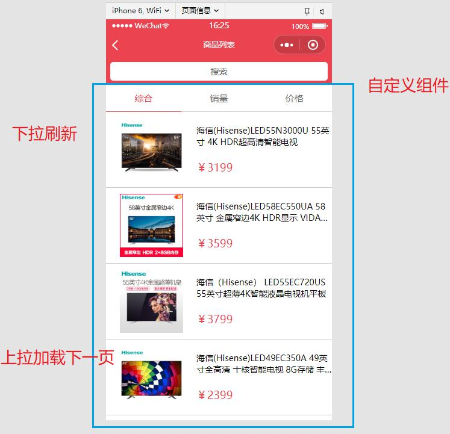
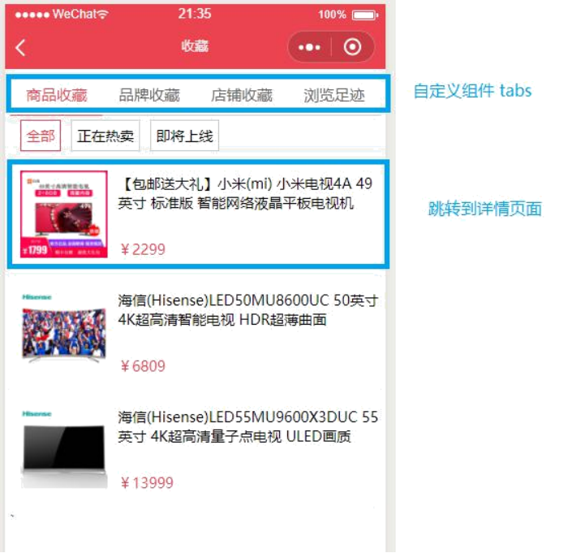
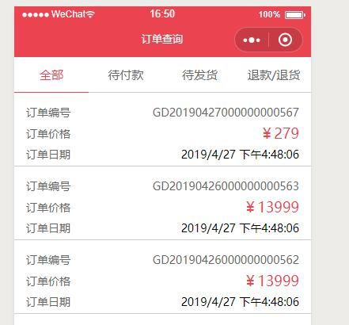

# 黑马优购项目

## 1. [接口文档](https://www.showdoc.com.cn/128719739414963) 

## 2. 帮助文档 

### 01. [小程序开发文档](https://developers.weixin.qq.com/miniprogram/dev/framework/) 

### 02. [MDN](https://developer.mozilla.org/zh-CN/)

### 03. [阿里巴巴字体 iconfont](https://www.iconfont.cn/)

## 3. 项目搭建

### 3.1. 新建小程序项目

> - 填入自己的appid

### 3.2. 搭建目录结构

| 目录名 | 作用 |
|---|---|
| styles | 存放公共样式 |
| components | 存放组件 |
| lib | 存放第三⽅库 |
| utils | 自⼰的帮助库 |
| request | 自⼰的接口帮助库 |

### 3.3. 搭建项目的页面

| 页面名称 | 名称 |
|---|---|
| ⾸页 | index |
| 分类页面 | category |
| 商品列表页面 | goods_list |
| 商品详情页面 | goods_detail |
| 购物车页面 | cart |
| 收藏页面 | collect |
| 订单页面 | order |
| 搜索页面 | search |
| 个⼈中⼼页面 | user |
| 意⻅反馈页面 | feedback |
| 登录页面 | login |
| 授权页面 | auth |
| 结算页面 | pay |

### 3.4. 引入字体图标 

1. 打开阿里巴巴字体图标网站 
2. 选择的图标 
3. 添加至项⽬ 
4. 下载到本地 
5. 将样式文件 由 css 修改为 wxss 
6. 小程序中引入 

### 3.5. 搭建项目tabbar结构 

参照之前讲解的小程序基础中的tabbar知识点

## 4. 首页

### 4.1. 效果


### 4.2. 业务逻辑

1. 使用tabbar实现底部导航栏功能
2. 使用自定义组件的方式实现**头部搜索框**
3. 加载**轮播图**数据
4. 加载**导航**数据
5. 加载**楼层**数据

### 4.3. 接口

1. 获取首页轮播图数据

```js
https://api.zbztb.cn/api/public/v1/home/swiperdatas/
```

2. 获取首页分类菜单数据

```js
https://api.zbztb.cn/api/public/v1/home/catitems/
```

3. 获取首页楼层数据

```js
https://api.zbztb.cn/api/public/v1/home/floordata/
```

### 4.4 关键技术

- 小程序内置 `request API`
- es6的 `promise`
- 小程序 `swiper` 组件
- 自定义组件实现搜索框

## 5. 分类页面

### 5.1. 效果


### 5.2. 业务逻辑

1. 加载分类页面数据
2. 点击左侧菜单，右侧数据动态渲染

### 5.3. 接口

1. 分类页面数据

```js
https://api.zbztb.cn/api/public/v1/categories
```

### 5.4. 关键技术

- `scroll-view` 组件
- es7的 `async` 和 `await`

### 5.5. 小程序中支持es7的async语法

es7 的 `async` 号称是解决回调的最终方案

1. 在小程序的开发工具中，勾选es6转es5语法
2. 下载facebook的regenerator库中的 [regenerator/packages/regenerator-runtime/runtime.js](https://github.com/facebook/regenerator/blob/5703a79746fffc152600fdcef46ba9230671025a/packages/regenerator-runtime/runtime.js)
3. 在小程序目录下新建文件夹 `lib/runtime/runtime.js` ，将代码拷贝进去
4. 在每一个需要使用async语法的页面js文件中，都引入（不能全局引入）

```js
import regeneratorRuntime from '../../lib/runtime/runtime';
```

## 6. 商品列表页面

### 6.1. 效果



### 6.2. 业务逻辑

1. 加载商品列表数据 
2. 启⽤下拉页面功能 
    - 页面的json文件中开启设置enablePullDownRefresh:true
    - 页面的js中，绑定事件 onPullDownRefresh
3. 启⽤上拉页面功能 onReachBottom 页面触底事件
4. 加载下⼀页功能 

### 6.3. 接口 

1. 商品列表搜索

```js
https://api.zbztb.cn/api/public/v1/goods/search
```

### 6.4. 关键技术

- 小程序配置文件中 **启⽤上拉** 和 **下拉** 功能
- **搜索框** 和 **tab** 栏是小程序的自定义组件(有组件事件和参数交互)

## 7. 商品详情页面 

### 7.1. 效果


### 7.2. 业务逻辑

1. 渲染商品详情数据
2. 点击图片，[调出图片画廊，进⾏预览](https://developers.weixin.qq.com/miniprogram/dev/api/media/image/wx.previewImage.html)
3. 点击收藏
4. 联系客服
5. 分享功能
6. 加入购物车

### 7.3. 接口

1. 获取详情数据接口

```js
https://api.zbztb.cn/api/public/v1/goods/detail
```

2. 加入购物车接口 使⽤本地存储来维护购物车数据
3. 立即购买接口 (相当于是 创建订单接口)

```js
https://api.zbztb.cn/api/public/v1/my/orders/create
```

### 7.4. 关键技术

- swiper组件
- 本地存储实现收藏功能
- **联系客服**小程序管理后台中，直接添加即可
- 富文本标签 渲染 富文本
- 小程序 预览图片接口

## 8. 收藏页

### 8.1. 效果



### 8.2. 业务逻辑

1. 获取本地存储中的数据进⾏渲染
2. 点击商品可以跳转到商品详情页面

### 8.3. 接口

无

### 8.4. 关键技术

- 小程序 自定义组件
- 本地存储 加载收藏数据

## 9. 购物车页面

### 9.1. 效果


### 9.2. 业务逻辑

1. 渲染购物车数据
2. 添加收货地址
3. 修改商品数量
4. 单选和全选功能

### 9.3. 接口

1. 获取购物车数据 本地存储实现
2. [调⽤微信的收货地址](https://developers.weixin.qq.com/miniprogram/dev/api/open-api/address/wx.chooseAddress.html)

### 9.4. 关键技术

- 小程序 选择收货地址 `api`
- 小程序 复选框 组件

## 10. 支付页面

### 10.1. 效果


### 10.2. 业务逻辑

1. 获取微信收货地址
2. 渲染购物车中要结算的商品
3. 实现支付
    - 获取微信的登录信息
    - 获取自⼰后台返回的支付相关参数
    - 调⽤微信接口实现 支付
    - 支付成功创建订单
    - 跳转到订单页面

### 10.3. 支付流程


### 10.4. 接口

1. 获取预支付参数

```js
https://api.zbztb.cn/api/public/v1/my/orders/req_unifiedorder
```

2. 创建订单

```js
https://api.zbztb.cn/api/public/v1/my/orders/create
```

3. 更新订单状态

```js
https://api.zbztb.cn/api/public/v1/my/orders/chkOrder
```

### 10.5. 关键技术

- 小程序 支付 api

## 11. 授权页面

### 11.1. 效果


### 11.2. 业务逻辑


1. 获取⽤⼾信息

返回 encryptedData,rawData,iv,signature

2. 小程序登录

返回 code

3. 提交数据到自⼰的后台，执⾏post请求 提交数据

```js
encryptedData,rawData,iv,signature code
```

4. 将 token 和⽤⼾数据 rawData 存入本地存储

### 11.3. 接口

1. 提交数据到后台 返回token

```js
https://api.zbztb.cn/api/public/v1/users/wxlogin
```

## 12. 订单列表页面

### 12.1. 效果



### 12.2. 业务逻辑
1. 根据不同的的状态去加载不同的订单数据
2. 点击标题紧挨着对应数据

### 12.3. 接口

1. 查询订单数据

```js
https://api.zbztb.cn/api/public/v1/my/orders/all
```

### 12.4. 关键技术

- 小程序 自定义组件的 传参 ⽗向⼦动态传参 this.selectComponent("#tabs");
- 时间戳 格式化处理

## 13. 搜索页面

### 13.1. 效果


### 13.2. 接口

1. 搜索建议查询

```js
https://api.zbztb.cn/api/public/v1/goods/qsearch
```

### 13.3. 业务逻辑

1. 获取输入框的值进⾏搜索和渲染
2. 点击 **取消** 按钮时 清除输入状态，修改页面模样

### 13.4. 关键技术

1. 小程序输入框组件
2. 输入值改变时，为了提⾼性能，使⽤ **防抖** 技术

## 14. 个⼈中⼼页面

### 14.1. 效果


### 14.2. 业务逻辑

1. 获取登录信息
2. 加载收藏信息
3. 查询订单状态

### 14.3. 接口

1. [获取⽤⼾信息](https://developers.weixin.qq.com/miniprogram/dev/api/open-api/user-info/wx.getUserInfo.html)
2. 获取收藏数据 从本地存储中获取
3. 获取订单数据

```js
https://api.zbztb.cn/api/public/v1/my/orders/all
```

### 14.4. 关键技术

1. [css属性filter的使⽤](https://www.runoob.com/cssref/css3-pr-filter.html)

## 15. 意⻅反馈页面

### 15.1. 效果


### 15.2. 业务逻辑

1. 点击 `+` 可以选择本地图片，并且显⽰到页面上
2. 点击 **提交** 可以上传图片到接口地址新浪图床上

```js
https://images.ac.cn/Home/Index/UploadAction/
```

3. 点击图片，会移除自⼰
4. 点击tab栏的标题，可以切换选中效果

### 15.3. 接口

无

### 15.4. 关键技术

1. 自定义组件 tab
2. 自定义组件 图片删除组件
3. 小程序上传文件api